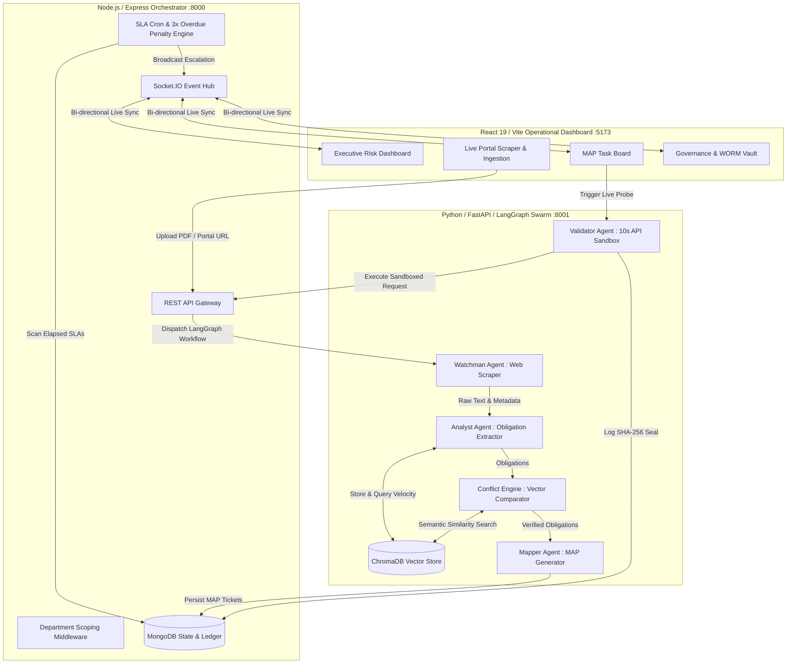
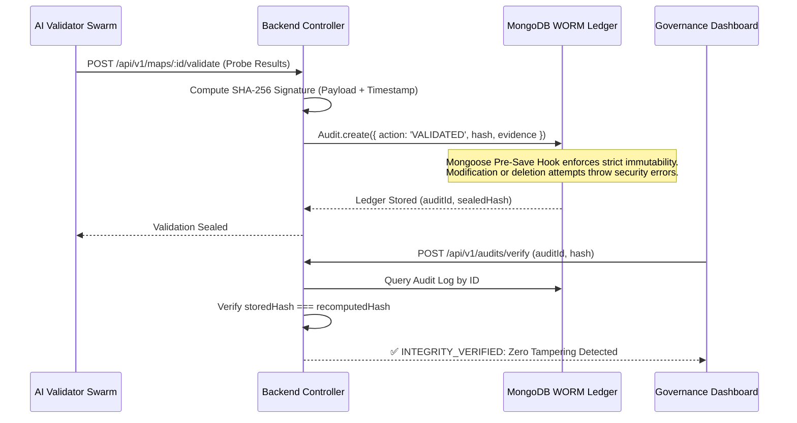

# 🛡️ ReguTwin Agentic OS 🤖📜
### Autonomous Regulatory Intelligence and Compliance Operating System

[](LICENSE)
[](docker-compose.yml)
[](frontend)
[](backend)
[](ai)
[](ai)

> **Transforming banking compliance from manual, reactive spreadsheet tracking into an autonomous, real-time, proof-based regulatory operating system.**

---

## 📖 Table of Contents
1. [🚨 The Challenge](#--the-challenge)
2. [💡 The ReguTwin Solution](#--the-regutwin-solution)
3. [🏛️ Enterprise Architecture & System Flow](#--enterprise-architecture--system-flow)
4. [🧠 LangGraph Autonomous AI Swarm](#--langgraph-autonomous-ai-swarm)
5. [🔐 WORM Governance Vault & Cryptographic Evidence](#--worm-governance-vault--cryptographic-evidence)
6. [✨ Key Hackathon Innovations](#--key-hackathon-innovations)
7. [🏆 Hackathon Judging Criteria Alignment](#--hackathon-judging-criteria-alignment)
8. [🐳 Quickstart (Docker Orchestration)](#--quickstart-docker-orchestration)
9. [💻 Local Development Guide](#--local-development-guide)
10. [📚 Documentation & Test Suites](#--documentation--test-suites)

---

## 🚨 The Challenge

Financial institutions face an overwhelming, continuous influx of complex regulatory mandates from governing bodies (e.g., RBI, SEBI). Traditional compliance operations rely heavily on human interpretation, fragmented emails, static PDFs, and spreadsheet tracking, leading to critical operational vulnerabilities:

*   **⚠️ Compliance Gaps & Latency:** Nuanced mandates in dense legal circulars are often overlooked or delayed during manual review.
*   **⚠️ Inter-Departmental Friction:** Unclear SLA ownership between IT Security, Risk, Legal, and Compliance departments causes implementation bottlenecks.
*   **⚠️ Hidden Contradictions:** New mandates frequently conflict with historical policies or overlapping regulations from different authorities.
*   **⚠️ Severe Audit Exposure:** Lacking immutable, verifiable proof of compliance leaves institutions vulnerable to massive regulatory fines.

---

## 💡 The ReguTwin Solution

**ReguTwin Agentic OS** bridges the gap between static LLM document wrappers and autonomous enterprise execution. It deploys a collaborative swarm of AI agents orchestrated via stateful graphs to autonomously manage the regulatory lifecycle:

1.  **Continuous Monitoring:** Scrapes official regulatory portals and ingests live circulars and PDFs.
2.  **Atomic Obligation Extraction:** Translates dense legal prose into granular obligations, deadlines, and risk classifications.
3.  **Semantic Conflict Intelligence:** Vector searches historical mandates in **ChromaDB** to detect contradictions before deployment begins.
4.  **Actionable MAP Generation:** Converts obligations into concrete **Measurable Action Points (MAPs)** with strict engineering criteria and assigns them to the correct department.
5.  **Proof-Based Autonomous Validation:** Executes live HTTP API probes and config checks within a 10-second sandboxed execution environment to verify real-world compliance.
6.  **Immutable WORM Vault:** Seals every compliance event with SHA-256 cryptographic hashes stored in Write-Once-Read-Many ledgers.

---

## 🏛️ Enterprise Architecture & System Flow

ReguTwin operates across three decoupled, synchronized layers communicating in real time via REST APIs and bi-directional WebSockets.



---

## 🧠 LangGraph Autonomous AI Swarm

The AI microservice does not rely on single-shot LLM prompts. Instead, it utilizes **LangGraph** to execute a deterministic, multi-agent state graph where each node represents a specialized domain worker:

1.  **🕵️‍♂️ Watchman Agent:** Continuously polls regulatory portals or processes uploaded PDFs, extracting clean document text and structural metadata.
2.  **⚖️ AI Regulation Analyst (`extract_obligations`):** Parses text using structured output schemas (Pydantic) to isolate mandatory actions ("Shall", "Must"), deadlines, systems affected, and baseline risk scores.
3.  **⚡ Semantic Conflict Engine (`detect_conflicts_node`):** Embeds incoming obligations into **ChromaDB** and retrieves semantically adjacent historical mandates. The reasoning engine analyzes overlapping requirements to flag critical regulatory deadlocks (e.g., *RBI requiring 30s KYC timeouts vs. SEBI requiring 60s minimums*).
4.  **🎯 MAP Generator (`generate_maps_node`):** Synthesizes legal obligations into actionable engineering deliverables. It assigns SLAs, identifies validation methods (`API_TEST`, `LOG_INSPECTION`), and routes tickets directly to departmental queues (*IT Security*, *Risk*, *Legal*, *Finance*).
5.  **🔬 Autonomous Validator:** Runs background execution tests against bank infrastructure to verify whether required controls are actively enforced.

Every transition emits real-time telemetry over `Socket.IO`, allowing users to watch the AI swarm's "internal monologue" live on the dashboard.

---

## 🔐 WORM Governance Vault & Cryptographic Evidence

To satisfy stringent banking audit standards, ReguTwin implements a cryptographic **Write-Once-Read-Many (WORM)** evidence vault.



---

## ✨ Key Hackathon Innovations

*   **⚡ Real-Time WebSocket Telemetry:** Experience zero-refresh UI updates. As agents reason, extract, and validate, live progress streams directly to the frontend.
*   **🚨 Dynamic 3× Overdue Penalty Engine:** A background Mongoose cron job continuously audits task SLAs. Overdue compliance tasks apply a 3× risk penalty, dynamically degrading the institution's real-time **Risk Health Score**.
*   **🧠 Longitudinal Compliance Velocity Memory:** Track enterprise resolution speed over time. The AI layer analyzes historical completion velocities to refine future SLA predictions and eliminate hallucinations.
*   **🛡️ Sandboxed 10-Second Validation Probes:** Automated HTTP API testing probes run inside a strict execution sandbox bounded by a 10-second SLA guard, preventing thread locking or memory leaks during high-throughput validation events.
*   **👥 Departmental RBAC Scoping:** Multi-tenant JWT middleware isolates department views. IT Security officers see only IT security controls, while executives retain an omniscient enterprise view.

---

## 🏆 Hackathon Judging Criteria Alignment

ReguTwin was built from the ground up to score 100/100 against master hackathon evaluation rubrics:

| Evaluation Dimension | Weight | ReguTwin Architectural Fulfillment |
| :--- | :---: | :--- |
| **1. Problem Understanding** | **25%** | Targets the exact operational friction banks face: translating dense regulatory circulars into traceable, multi-departmental engineering tasks. |
| **2. Originality & Innovation** | **25%** | Pioneers **Semantic Conflict Detection** across different governing bodies and replaces human attestation with **Proof-Based API Validation**. |
| **3. Technical Implementation** | **25%** | Features a pristine 3-layer architecture, LangGraph multi-agent orchestration, vector memory, WebSocket live streams, and SHA-256 WORM vaults. |
| **4. Real-World Applicability** | **25%** | Fully containerized, supports local open-weights LLMs (Llama 3.1) for strict bank data privacy or cloud LLMs (Gemini/OpenAI) for rapid scaling. |

---

## 🐳 Quickstart (Docker Orchestration)

The quickest way to evaluate ReguTwin is via Docker Compose. The entire enterprise stack boots with a single command.

### Prerequisites
1.  **Docker & Docker Compose** installed.
2.  *(Optional for Local LLM)* **Ollama** running on your host machine with Llama 3.1 pulled (`ollama run llama3.1:8b`). Alternatively, set `LLM_PROVIDER=gemini` and provide a `GEMINI_API_KEY` in `ai/.env`.

### 🚀 1-Command Boot
```bash
# Clone repository and boot containers
git clone https://github.com/mdkamranalam/regutwin-agentic-os.git
cd regutwin-agentic-os
docker-compose up --build -d
```

### 🌐 Service Endpoints
*   **🖥️ Frontend Operational Portal:** [http://localhost:5173](http://localhost:5173)
*   **⚙️ Backend REST API Gateway:** [http://localhost:8000/api/v1/health](http://localhost:8000/api/v1/health)
*   **🤖 AI Swarm Microservice:** [http://localhost:8001/docs](http://localhost:8001/docs) *(Swagger UI)*

---

## 💻 Local Development Guide

To run services individually for debugging or local extension:

### 1. Backend Orchestrator (`:8000`)
```bash
cd backend
npm install
cp .env.example .env
npm run dev
```

### 2. Frontend Workspace (`:5173`)
```bash
cd frontend
npm install
npm run dev
```

### 3. AI Swarm Layer (`:8001`)
```bash
cd ai
python3 -m venv venv
source venv/bin/activate  # On Windows: venv\Scripts\activate
pip install -r requirements.txt
cp .env.example .env
python main.py
```

---

## 📚 Documentation & Test Suites

Explore our comprehensive repository documentation to verify deep architectural workflows and run verification benchmarks:

*   **📋 [Hackathon Briefing & Solution Specification](HACKATHON.md):** Detailed problem alignment and evaluation scoring breakdown.
*   **🧪 [Master E2E Test Cases Walkthrough](test.md):** Step-by-step test protocols for judges to verify RBAC, live scraping, MAP generation, and validation probes.
*   **🏗️ [Architecture & Evaluation Guide](finalTests.md):** Deep-dive technical blueprints, data flows, and 1,000-iteration synthetic stability benchmarks.
*   **⚙️ [Backend Engine Documentation](backend/README.md):** API routes, WebSocket event catalog, and WORM vault specs.
*   **🖥️ [Frontend UI Documentation](frontend/README.md):** State management (Zustand), UI modules, and real-time telemetry design.
*   **🤖 [AI Swarm Documentation](ai/README.md):** Agentic reasoning principles, LangGraph structure, and ChromaDB vector integrations.

---

### 🌟 Built for the Autonomous Banking Future.
*Transforming compliance from a cost center into an autonomous regulatory advantage.*
