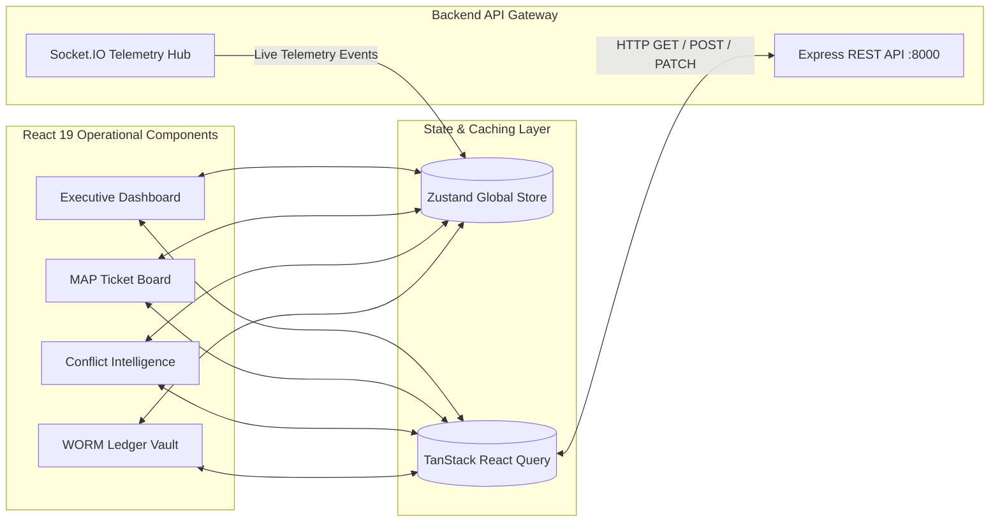

# 🖥️ ReguTwin Frontend Operational Workspace

[](https://react.dev/)
[](https://vitejs.dev/)
[](https://tailwindcss.com/)
[](package.json)

## Overview

The **ReguTwin Frontend Workspace** is an enterprise-grade operational interface designed for real-time banking compliance management. It acts as the command center where compliance officers, auditors, IT security engineers, and executive stakeholders interact with the autonomous AI compliance engine.

Built with **React 19**, **Vite**, and **TailwindCSS v4**, the frontend delivers a responsive, dark-mode glassmorphism experience featuring zero-refresh WebSocket telemetry streams from live LangGraph agent execution.

---

## 🏛️ UI Architecture & Telemetry Flow



---

## 👥 Multi-Tenant Role-Based Access Control (RBAC)

The UI dynamically morphs based on the authenticated user's department and role:

| Role / Department | Dashboard Visibility | Key Capabilities |
| :--- | :--- | :--- |
| **👑 Executive Admin** | Full Enterprise View | Trigger live seeding, ingest new regulatory circulars, oversee all departments. |
| **🛡️ IT Security Officer** | Scoped to `IT Security` | Review technical MAPs, execute sandboxed API probes against endpoints. |
| **⚖️ Risk & Compliance Officer** | Scoped to `Risk` & `Compliance` | Investigate semantic vector deadlocks, review deadline SLA penalties. |
| **🔍 External Auditor** | Scoped to Governance Vault | Verify cryptographic SHA-256 seals, export sealed PDF/CSV compliance reports. |

---

## 🧩 Core Workspace Modules

### 1. 📊 Executive Risk Dashboard (`/dashboard`)
*   Real-time compliance health scoring with dynamic 3× penalty weighting for overdue SLAs.
*   Live AI execution telemetry feed showing Watchman and Analyst nodes processing tasks.
*   **Longitudinal Compliance Velocity Curve:** Visualizes historical completion acceleration over rolling 30-day windows.

### 2. 📑 Regulatory Explorer & Live Scraper (`/upload`)
*   Interactive Web Scraper tab polling official RBI and SEBI portals.
*   Drag-and-drop PDF ingestion dropzone triggering automated background OCR and vector embedding.

### 3. 🎯 Measurable Action Points Board (`/maps`)
*   Kanban and tabular layout tracking actionable compliance tickets.
*   Embedded **API Test Configurator** allowing officers to configure target HTTP probes (`GET`, `POST`, Expected Status `200`) and execute sandboxed 10s verification tests.

### 4. ⚡ Semantic Conflict Registry (`/conflicts`)
*   Visual cards displaying cross-authority regulatory contradictions (e.g., *RBI vs SEBI deadlocks*).
*   AI-generated mitigation strategies detailing route-based policy reconciliations.

### 5. 🔒 WORM Governance Vault (`/audits` & `/reports`)
*   Chronological ledger displaying cryptographic SHA-256 signatures for every verification event.
*   One-click WORM integrity verification modal and PDF/CSV compliance report export engine.

---

## 📦 State Management & Real-Time Sync

*   **Global Client State (`Zustand`):** Manages user session tokens, active RBAC scope selections, dark mode preferences, and ephemeral WebSocket notification banners.
*   **Server Cache & Synchronization (`TanStack React Query`):** Handles background refetching, optimistic UI updates on task transitions, and caching of heavy regulatory payloads.
*   **Live WebSockets (`Socket.IO Client`):** Listens to event streams (`agent:thinking`, `map:created`, `conflict:flagged`) to update progress indicators seamlessly without page reloads.

---

## 🚀 Quickstart Guide

### 1. Installation
```bash
cd frontend
npm install
```

### 2. Environment Setup (`.env`)
Create a `.env` file in `/frontend`:
```env
VITE_API_URL=http://localhost:8000/api/v1
VITE_SOCKET_URL=http://localhost:8000
VITE_DEMO_MODE=true
```

### 3. Execution
```bash
# Start Vite high-speed development server
npm run dev

# Build production bundle
npm run build
```
